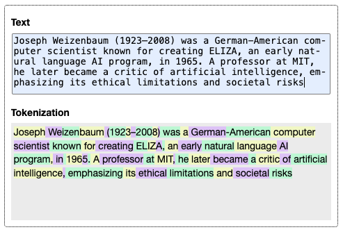

# tiktoken-bundle #

offline-capable ESM module for cl100k_base tokenization in the browser

This JavaScript/TypeScript library provides tokenization functionality using the cl100k_base encoding (the same encoding used by GPT-3.5 and GPT-4 models) and is specifically designed to work in browser environments without network requests (see [Live Demo](https://rozek.de/applets/Tokenization.html) for a visualization of tokens).



## Installation ##

The `tiktoken-bundle` comes as an ECMAScript module (ESM). You may either install the module using `npm` (or similar) if you still plan to use a bundler:

```bash
npm install tiktoken-bundle
```

Or you may dynamically import it using an `import` expression

```javascript
const {
  TokensOfText, TextFromTokens, NumberOfTokensInText, TokenizationOfText
} = await import("https://rozek.github.io/tiktoken-bundle/dist/tiktoken-bundle.js")
```

## Usage in Node.js or Browser Environments ##

Assuming that you have installed the module, you may proceed as follows

```typescript
import {
  TokensOfText, TextFromTokens, NumberOfTokensInText, TokenizationOfText
} from 'tiktoken-bundle'

const Tokens = TokensOfText('Hello, world!')
// [9906, 11, 4435, 0]

const Text = TextFromTokens([9906, 11, 4435, 0])
// 'Hello, world!'

const NumberOfTokens = NumberOfTokensInText('Hello, world!')
// 4

const Tokenization = TokenizationOfText('Hello, world!')
// [
//   [9906, 'Hello'],
//   [11, ', '],
//   [4435, 'world'],
//   [0, '!']
// ]
```

## Usage within Svelte ##

For Svelte, it is recommended to import the package in a module context:

```html
<script context="module">
import {
  TokensOfText, TextFromTokens, NumberOfTokensInText, TokenizationOfText
} from 'tiktoken-bundle'
</script>

<script>
const Tokens = TokensOfText('Hello, world!')
// [9906, 11, 4435, 0]

const Text = TextFromTokens([9906, 11, 4435, 0])
// 'Hello, world!'

const NumberOfTokens = NumberOfTokensInText('Hello, world!')
// 4

const Tokenization = TokenizationOfText('Hello, world!')
// [
//   [9906, 'Hello'],
//   [11, ', '],
//   [4435, 'world'],
//   [0, '!']
// ]
</script>
```

## API Reference

* `TokensOfText(Text:string): number[]` - converts `Text` to an array of token IDs
* `TextFromTokens(TokenList:number[]):string` - converts an array of token IDs back to text
* `NumberOfTokensInText(Text:string):number` - counts the number of tokens in `Text`
* `TokenizationOfText(Text:string):[number,string][]` - returns an array of token ID and token string pairs

## Build Instructions ##

You may easily build this package yourself.

Just install [NPM](https://docs.npmjs.com/) according to the instructions for your platform and follow these steps:

1. either clone this repository using [git](https://git-scm.com/) or [download a ZIP archive](https://github.com/rozek/tiktoken-bundle/archive/refs/heads/main.zip) with its contents to your disk and unpack it there 
2. open a shell and navigate to the root directory of this repository
3. run `npm install` in order to install the complete build environment
4. execute `npm run build` to create a new build

You may also look into the author's [build-configuration-study](https://github.com/rozek/build-configuration-study) for a general description of his build environment.

## Test Instructions ##

`tiktoken-bundle` comes with a few tests. Just use

```bash
npm run test
```

to run them and get a report on the console.

## License ##

[MIT License](LICENSE.md)
